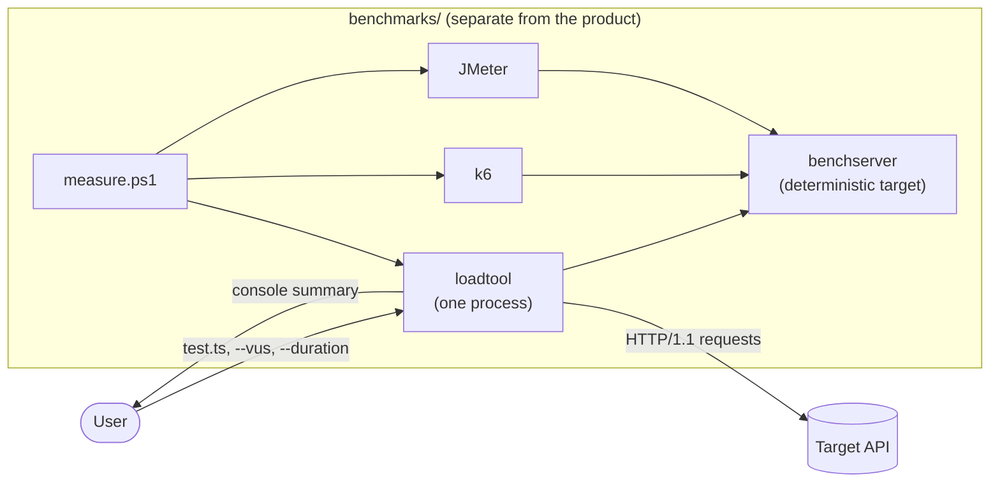
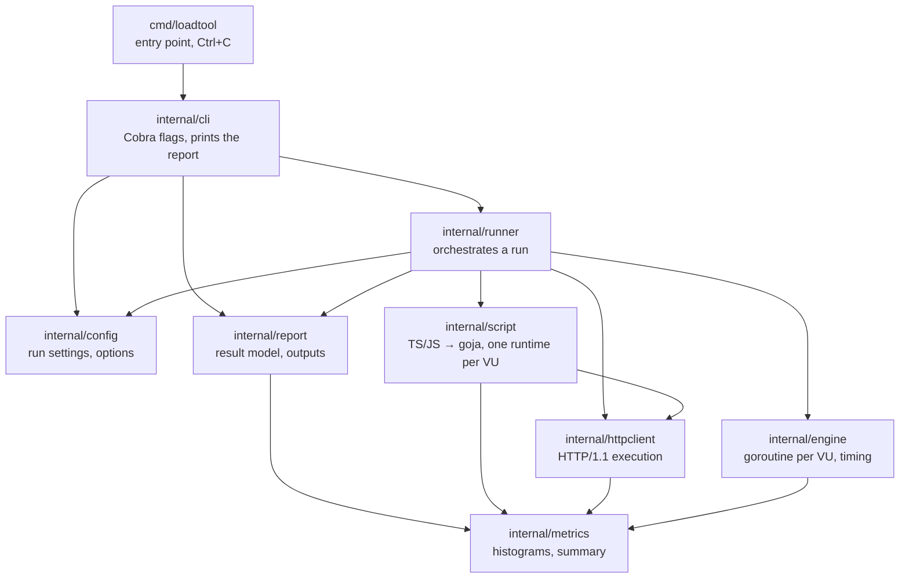
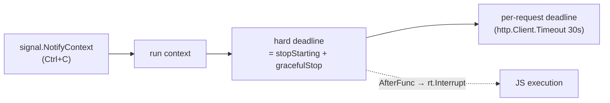
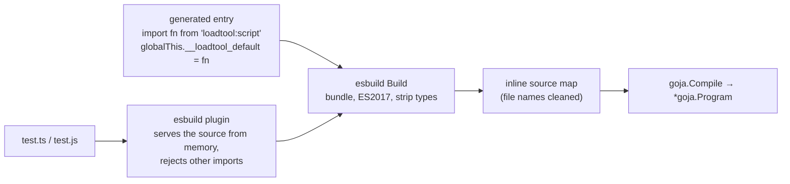

# LoadTool architecture

The first section shows the target architecture by phase. Sections 1–14
describe the code in detail as it stands at the end of Phase 0 (October
2026); Phase 1 changes are noted where they have been made.
- **Decisions:** the *why* behind individual choices is in the
  [architecture decision records](decisions/README.md).
- **Numbers:** measured figures come from [`benchmarks/results`](../benchmarks/results/)
  and are dated, because they were taken at different commits.
- **Workflows:** step-by-step diagrams of a test run, of development and
  of benchmarking are in [workflows.md](workflows.md).

## Architecture by phase

```text
Phase 0
    │
    ├── CLI
    ├── Runner
    ├── VU
    ├── goja
    ├── HTTP
    ├── Metrics
    └── Console
             │
             ▼
Phase 1
    │
    ├── DSL
    ├── Scenario Engine
    ├── Checks
    ├── Thresholds
    ├── HTTP/2
    ├── Sessions
    ├── JSON Reporter
    ├── HTML Reporter
    └── CI
```

Phase 1 extends the Phase 0 components; it does not replace them. Every
Phase 1 component builds on a Phase 0 component. Each column below is one
Phase 0 component (top) and the Phase 1 components that extend it; the
secondary relations (for example Thresholds setting the Runner's exit
code) are in the Phase 1 table.



Blue: Phase 0 (done). Green: Phase 1 (extends the component above it).
Source: [diagrams/architecture-by-phase.mmd](diagrams/architecture-by-phase.mmd).

### Phase 0 components

| Component | Package | Status |
|---|---|---|
| CLI | `cmd/loadtool`, `internal/cli` | Done |
| Runner | `internal/runner` | Done. Orchestrates a run: load the script, resolve options, start VUs, run the engine, return the `report.Result`. Extracted from the CLI in Phase 1 step 3, so the CLI only parses flags and prints. Runs the lifecycle: setup once, the load phase, then teardown whenever setup completed (ADR-008). Scenarios and thresholds extend the Runner. |
| VU | `internal/engine` | Done: goroutine per VU, started before the clock, graceful stop |
| goja | `internal/script` | Done: one runtime per VU, call-depth limit, interrupts |
| HTTP | `internal/httpclient` | Done: HTTP/1.1, at most one connection per VU, keep-alive (HTTP/2 added in Phase 1, ADR-010) |
| Metrics | `internal/metrics` | Done: fixed-size sharded histograms (ADR-004) |
| Console | `internal/report` (`Console`) | Done: renders from `report.Result` |

### Phase 1 components

| Component | Extends | Package | Covers roadmap items | Status |
|---|---|---|---|---|
| DSL | goja | `internal/script` (built-in modules `loadtool`, `loadtool/http`; lifecycle exports; `__ENV`, `__VU`, `__ITER`), published `types/loadtool.d.ts` | 1 TypeScript DSL, 2 setup/teardown (script side) | Core done: `options` (ADR-006); built-in modules, relative imports, `__ENV`/`__VU`/`__ITER`, `console`, `sleep`, `group` (ADR-007). Responses and `post`/`put`/`patch`/`del`, `setup`/`teardown` (ADR-008). k6-shaped (ADR-005) |
| Scenario Engine | VU, Runner | `internal/engine` (executors: constant-vus, ramping-vus, constant-arrival-rate; scenarios) | 5 scenarios, 2 setup/teardown (run order) | Done (ADR-008): `engine.RunScenarios` with constant-vus, ramping-vus and constant-arrival-rate; setup/teardown run order in the Runner (`script.Lifecycle`) |
| Checks | DSL, Metrics | `check()` in `internal/script`; `checks` metric in `internal/metrics` | 3 checks/assertions | Done (ADR-008) |
| Thresholds | Metrics, Runner | new `internal/thresholds` | 4 thresholds; exit code | Done (ADR-008): `internal/thresholds`, exit code 99 |
| HTTP/2 | HTTP | `internal/httpclient` | 6 HTTP/2 | Done (ADR-010): `httpVersion` auto/1.1/2 with h2c through `http.Protocols`; `res.proto` |
| Sessions | HTTP | `internal/httpclient` (per-VU client and cookie jar; reuse options) | 7 connection reuse, 8 cookies/sessions | Done (ADR-009): per-VU client and lazy cookie jar over the shared transport; `noCookiesReset`, `noConnectionReuse` |
| JSON Reporter | Console (`report.Result`) | `internal/report` | 9 JSON output | Done (ADR-011): `--summary-json`, schema version 1, `docs/json-summary.md` |
| HTML Reporter | Console (`report.Result`) | `internal/report` | 10 self-contained HTML report | Done (ADR-012): `--report-html`, per-second series sampled from the shared histograms |
| CI | CLI | `action.yml`, `.github/workflows/release.yml`, `docs/ci/` | 11 GitHub Action, 12 generic CI recipe | Done: `scripts/release-build.sh`, `release.yml` (tag → GitHub release), composite `action.yml` (self-tested in CI), `docs/ci/` |

Roadmap items 13–15 (documentation, 5–10 examples, preparation for
external users) are deliverables around these components (`docs/`,
`examples/`, releases), not runtime components.

### Phase 1 build order

Each step is one branch merged into `phase-1-mvp` after CI passes.

| # | Step | Component | Status |
|---|---|---|---|
| 1 | Result model; console output moved to `internal/report` | Console | Done |
| 2 | `export const options`, with precedence (ADR-006) | DSL / Runner | Done |
| 3 | Extract the Runner from the CLI into `internal/runner` (no behaviour change) | Runner | Done |
| 4 | Built-in modules, local imports, `sleep`/`group`, `__ENV`/`__VU`/`__ITER`, `console`, published types (ADR-007) | DSL | Done |
| 5 | Response access, `post`/`put`/`patch`/`del` (5a); `check()` and per-check results (5b) | Checks | Done |
| 6 | Threshold expressions and exit code | Thresholds | Done |
| 7 | `setup`/`teardown` lifecycle (7a); executors and multiple scenarios (7b) | Scenario Engine | Done |
| 8 | Per-VU client and cookie jar, connection-reuse options | Sessions | Done |
| 9 | HTTP/2 and h2c | HTTP/2 | Done |
| 10 | Versioned JSON output | JSON Reporter | Done |
| 11 | Self-contained HTML report with time series | HTML Reporter | Done |
| 12 | Release builds, GitHub Action, generic CI recipe | CI | Done (no release published yet) |
| 13 | Documentation, 5–10 examples, preparation for external users | — | Planned |
| 14 | Re-run the benchmark; agree and check the Phase 1 exit criteria | — | Planned |

A memory benchmark runs after steps 4, 7 and 8, which add per-VU state.
Step 4: [`benchmarks/results/2026-10-04-dsl-core-memory.md`](../benchmarks/results/2026-10-04-dsl-core-memory.md).

## 1. What LoadTool is

LoadTool is a load-testing engine written in Go.
- Users write a test as a **TypeScript or JavaScript file** that exports a
  default function.
- LoadTool runs that function in a loop on **N virtual users (VUs)**, one
  goroutine each, for a fixed duration.
- Each VU sends **HTTP/1.1** requests to the target and records them.
- At the end, LoadTool prints a summary: request and error counts,
  throughput, and latency percentiles.

```bash
loadtool run examples/basic-http.ts --vus 1000 --duration 60s
```

Phase 0 is deliberately small: one process, one protocol, one load model.
Distributed execution, storage, dashboards and other protocols belong to
later phases (see `CLAUDE.md`).

## 2. System context



The benchmark tooling uses LoadTool from the outside, like any other tool,
and the benchmark server is independent of LoadTool's code (§11).

## 3. Components and dependencies



The arrows are the actual import graph (`go list`). Three boundaries
matter:
- **`engine` imports neither `script` nor `httpclient`.** It schedules
  opaque iterations (`IterationFunc`) and knows nothing about JavaScript
  or HTTP. New protocols or script runtimes plug in without changing it.
- **`runner` is the only place that wires the engine components
  together;** `cli` only parses flags and prints. No package
  reaches across to another's internals, and there is no global mutable
  state.
  - The package-level variables that exist are never modified after
    start-up: error values, the script entry text and the computed bucket
    count.
  - The one exception is `cli.Version`, which is set at build time.
- **`metrics` is the shared leaf.** Every layer records into it, and it
  depends on nothing.

| Package | Responsibility | Key API | Lines (code / tests) |
|---|---|---|---|
| `cmd/loadtool` | Process entry; maps Ctrl+C to context cancellation; exit codes | `main` | 26 / 0 |
| `internal/cli` | Flags; prints the report; exit codes | `NewRootCmd` | 111 / 284 |
| `internal/runner` | Orchestrates a run: script, options, VUs, engine, result | `Run`, `Params` | 94 / 148 |
| `internal/report` | Result model; renders outputs (console today; JSON and HTML in Phase 1) | `Result`, `Console` | 110 / 81 |
| `internal/config` | Run settings and validation | `Config.Validate` | 39 / 55 |
| `internal/engine` | VU start-up, one goroutine per VU, duration and graceful stop | `Run`, `IterationFunc`, `NewVUFunc` | 81 / 258 |
| `internal/script` | Transpile and compile scripts; per-VU goja runtime; the `http` script API | `Load`, `Compile`, `Program.NewVU`, `VU.Iterate` | 364 / 576 |
| `internal/httpclient` | Tuned HTTP/1.1 client; sends one request, times it, records it | `New`, `Do` | 112 / 328 |
| `internal/metrics` | Latency histograms, counters, merging into a summary | `NewRecorders`, `Recorder`, `Merge`, `Summary` | 269 / 308 |
| `benchmarks/server` | Deterministic benchmark target (standard library only) | `GET /api/test`, `GET /health` | 113 / 184 |

External modules: `spf13/cobra` (CLI), `dop251/goja` (JavaScript engine)
and `evanw/esbuild` (TypeScript transpiling). Everything else is the Go
standard library.

## 4. Lifecycle of a run

```mermaid
sequenceDiagram
    autonumber
    participant M as main
    participant C as runner.Run
    participant S as script
    participant E as engine.Run
    participant V as VU goroutines
    participant H as httpclient
    participant X as metrics

    M->>C: cli parses flags, calls runner.Run(ctx)  [Ctrl+C cancels ctx]
    C->>S: Load(test.ts): esbuild bundle → goja.Compile (once)
    C->>S: Options(): run top-level code once, read `options`
    Note over C: resolve settings: CLI flag > LOADTOOL_* env > script options > default
    C->>H: New(VUs, 30s): one shared http.Client
    C->>E: Run(ctx, vus, duration, gracefulStop, newVU)
    loop for each VU, sequentially, before the clock starts
        E->>S: newVU(i) → Program.NewVU(ctx, client)
        S-->>E: VU.Iterate  (own goja runtime, top-level code run once)
    end
    Note over E: start clock: stopStarting = now + duration<br/>hard deadline = stopStarting + gracefulStop
    E->>X: NewRecorders(vus): 16 shared shards
    par one goroutine per VU
        loop while now < stopStarting and ctx not done
            V->>S: Iterate(ctx, rec): call default()
            S->>H: http.get / http.request → Do(ctx, client, req, rec)
            H->>X: rec.Record(latency, ok)
        end
    end
    E->>E: wait for all VUs (in-flight iterations may finish until the hard deadline)
    E->>X: Merge(recorders) → Summary
    E-->>C: Result{Summary, Elapsed}
    C-->>M: report.Result → cli prints it; exit 1 if interrupted
```

**Phases of a run:**
1. **Compile once.** esbuild transpiles and bundles the script, and goja
   compiles it into an immutable `*goja.Program` that all VUs share.
2. **Start every VU before the clock.** Each VU gets its own goja runtime
   and runs the script's top-level code once. Any error here aborts the
   run before any load is sent. VU start-up time is therefore not part of
   the measured duration.
3. **Load phase.** Every VU loops, calling the script's default function,
   until `--duration` ends.
4. **Graceful stop.** After `--duration`, no new iterations start. Running
   ones may finish for up to `--graceful-stop` (default 30 s) and are
   counted; after that they are cancelled.
5. **Merge and report.** The recorders are merged into one `Summary` after
   all VU goroutines have exited.

## 5. The hot path

Per iteration, per VU:

| Step | Where | Notes |
|---|---|---|
| Check the stop time and context | `engine.runVU` | `time.Now()` against the stop time, plus `ctx.Err()` |
| Register the interrupt hook | `script.VU.Iterate` | `context.AfterFunc(ctx, rt.Interrupt)`, so a script stuck in a loop can be stopped |
| Call the default function | goja | The VU's own runtime; no locks |
| `http.get` / `http.request` | `script/http.go` | Converts JS arguments, builds `httpclient.Request` |
| Send and time the request | `httpclient.Do` | Builds the request, `client.Do`, reads the body to the end, closes it |
| Record | `metrics.Recorder.Record` | One atomic increment in a shared histogram shard; 0 allocations |
| Build the JS response | `script/http.go` | `{status, error, timings: {duration}}` |

Measured costs, each as of its date:

| Measure | Value | Source |
|---|---|---|
| Iteration overhead, empty script | ~370 ns, 4 allocations | 2026-09-24 script-execution results |
| Script layer on top of an HTTP request | +17 allocations, ~1.5 KB | same |
| `Record` | 16–24 ns, 0 B, 0 allocations | 2026-10-01 latency-histogram results |
| `Record` from 12 CPUs into shared shards | ~3 ns/op total | same |

The hot path takes **no mutex of LoadTool's own**. It does share two
contention points with every VU:
- **One context.** The per-iteration `AfterFunc` and `http.Client`'s
  per-request deadline both register on the run's single context, whose
  mutex all VUs share. Measured: about 0.8M iterations/s maximum on 12
  CPUs. That is about 2–3 % busy at the 20–25k req/s seen so far.
- **The `http.Transport` connection pool,** which has its own locking.

## 6. Concurrency model

### Goroutines

| Goroutine | Count | Lifetime |
|---|---|---|
| main / Cobra | 1 | Process |
| VU | one per VU | From the clock starting until the VU's loop ends; `Run` waits for all of them (`sync.WaitGroup`) |
| `net/http` connection goroutines | 2 per open connection (read and write loops) | Until the connection closes; `CloseIdleConnections` runs at the end of `runTest` |
| `AfterFunc` callbacks | short-lived | Only when a context ends; they call `rt.Interrupt` |

No hidden long-lived goroutines are started. The `-race` tests in CI and
goroutine-count probes (counts back to baseline after completed,
interrupted and endless-loop runs) cover leaks and races.

### Shared and per-VU state

| State | Shared by | Why it is safe |
|---|---|---|
| `*goja.Program` | all VUs | Immutable; goja documents it as safe for concurrent use |
| `*http.Client` / `Transport` | all VUs | Safe for concurrent use; one connection pool |
| Histogram shards (16) | about VUs/16 each | Atomic counters, and CAS for min and max |
| `goja.Runtime` | **one VU** | Not goroutine-safe; only its VU's goroutine touches it, apart from `Interrupt`, which goja documents as safe |
| `VU.ctx`, `VU.rec` | one VU | Set and read on the VU's goroutine during `Iterate` |
| `Recorder` counters (unsent, script errors) | one VU | Plain ints, read only after `wg.Wait()` |

### Contexts and stopping



| Event | Effect |
|---|---|
| `--duration` ends | VUs stop starting iterations; running ones continue |
| Graceful stop ends | Context cancelled: requests aborted, JS interrupted; nothing in flight is recorded |
| First Ctrl+C | Context cancelled at once (VU start-up included); a partial summary is printed; exit code 1 |
| Second Ctrl+C | Default signal handling is restored after the first, so the process terminates |
| Request timeout (30 s) | The request fails and is counted as an error |

## 7. Script runtime



- **Bundling, not CommonJS conversion.** Binding the default export inside
  one bundle produces no interop helpers. That cut each VU's retained
  memory from about 30 KB to about 6 KB (ADR-001).
- **Isolation.** Each VU has its own runtime, so module-level variables
  are per VU.
- **API.**
  - `http.get(url, params?)` and `http.request(method, url, body?, params?)`
    return `{status, error, timings: {duration}}`.
  - Transport errors don't throw; they set `status: 0` and `error`.
  - HTTP calls in top-level code throw.
- **Limits.**
  - Call depth is 2,500 frames per VU. Runaway recursion becomes a script
    error; worst case is about 1.7 MB per VU.
  - Scripts can't import other files.
  - TypeScript types are stripped, not checked.
  - No `async`.
- **Errors.** An exception ends that iteration only. It's counted, and the
  first message (with the `.ts` line, via the source map) appears in the
  summary.

## 8. HTTP layer

`httpclient.New(VUs, 30s)` builds one client:

| Setting | Value | Reason |
|---|---|---|
| `MaxConnsPerHost` | VUs | At most one connection per VU. Without it, background dials piled up and a 1,000-VU run crashed with thread exhaustion on Windows. |
| `MaxIdleConns(PerHost)` | VUs | Every VU keeps its keep-alive connection |
| HTTP/2 | Phase 0: disabled, including over TLS. Phase 1: `options.httpVersion`, default `"auto"` (HTTP/2 over TLS when offered) | ADR-010 |
| Redirects | not followed | One iteration = one measured request |
| `DisableCompression` | true | No implicit `Accept-Encoding: gzip`, matching k6 and JMeter |
| Timeout | 30 s, including reading the body | — |

`Do` times from just before `client.Do` until the body is fully read and
closed, so latency includes any connection setup. A 2xx or 3xx status
counts as success.

## 9. Metrics

- **Storage.** Log-linear histograms: 64 sub-buckets per power of two and
  2,368 buckets up to 1 h, about 19 KB each (ADR-004).
- **Layout.** Each of the **16 shards** holds a successful-request and a
  failed-request histogram. VU *i* records into shard *i* mod 16 with
  atomic operations. Total about **0.6 MB**, independent of VU count,
  duration and request rate.
- **Precision.** Percentiles are within ±0.78 %. Counts, min, max and mean
  are exact.
- **Two latency sets in the summary:** all requests that were sent (the
  population k6 and JMeter use), and successful requests only, which fast
  failures such as refused connections cannot pull down.
- **Requests never sent** (for example invalid URLs) count as failures
  without a latency sample.

## 10. Memory

Measured per VU (retained heap):
- goja runtime: about **6 KB**
  (`BenchmarkVURetainedMemory`, 2026-10-01)
- plus the VU's goroutine stack and its connection's buffers and two
  goroutines (not measured separately)

Measured per process (2026-10-01 comparison, 60 s runs, before the
histogram):

| VUs | Peak private bytes | Average working set |
|---|---|---|
| 100 | 70–77 MB | 33–35 MB |
| 1,000 | 190–210 MB | 119–152 MB |

- At 1,000 VUs most of the peak is GC headroom and short-lived per-request
  garbage, not per-VU state.
- Since ADR-004, peak memory does not grow with run length: 62.0 MB at
  20 s and 61.8 MB at 120 s for the same 50-VU test.

## 11. Benchmark subsystem

Separate from the product, under `benchmarks/`:

| Part | Role |
|---|---|
| `server/` | Deterministic target: fixed JSON body after a fixed delay, no `Date` header, standard library only (a test enforces this) |
| `loadtool/`, `k6/`, `jmeter/` | The same scenario for each tool: `GET /api/test`, all VUs at once, no think time, keep-alive, success = 200 |
| `measure.ps1` | Harness: starts the server, records the environment, runs warm-ups, then alternating measured runs; samples each tool's process for CPU and memory; one JSON line per run |
| `summarize.ps1` | Median and range tables from `runs.jsonl` |
| `results/` | Dated reports with raw data, separating measured values, calculated values and observations |

## 12. Quality gates

- **Tests.** Go `testing`, with every package covered. HTTP tests use
  local `httptest` servers; no test depends on the internet. Key
  behaviours are checked by mutation: the tests fail when the fix is
  removed.
- **CI** (`.github/workflows/ci.yml`):
  - gofmt and `go vet`
  - `go test` on Linux and Windows
  - `go test -race -count=3` on Linux, because the race detector needs cgo,
    which the Windows development machine lacks
- **Benchmarks.** Micro-benchmarks for recording, merging, VU creation
  and the iteration path. End-to-end comparisons through `measure.ps1`.

## 13. Known limitations and open items

From the Phase 0 performance review:

| Item | Status |
|---|---|
| Latency definitions differ between tools (LoadTool includes connection setup and pool wait; k6's `http_req_duration` does not) | Open (M2) |
| LoadTool logs more errors than k6 against the same refusing server | Open, not explained (M6) |
| Comparison runs were on one laptop; the target refused connections at ≥250 VUs | Needs a separate server machine (H3) |
| Shared-context mutex per iteration | Not a bottleneck at measured rates (L1) |
| `MaxIdleConns` is a total across hosts; multi-host scripts would churn connections | Open (L3) |
| A Go panic inside one iteration ends the process (no per-VU recover) | Open (L4) |
| Windows timer resolution about 0.5 ms | Platform limit |

## 14. Extension points for later phases

These are the seams the current design leaves open. None is implemented,
and each would need its own decision record.
- **Other protocols:** a new package that records into
  `metrics.Recorder`, exposed to scripts the way `http` is.
  `engine` does not change.
- **Load models** (ramping, arrival rate): replace or extend the loop in
  `engine.runVU` and the VU start-up in `engine.Run`. The
  `IterationFunc`/`NewVUFunc` contract stays.
- **Distributed execution:** histogram shards merge by adding bucket
  counts, so results from several machines can be combined exactly the
  same way.
- **Result output** (files, dashboards): consume `metrics.Summary`, or
  the shard histograms for full distributions, from `cli`.
