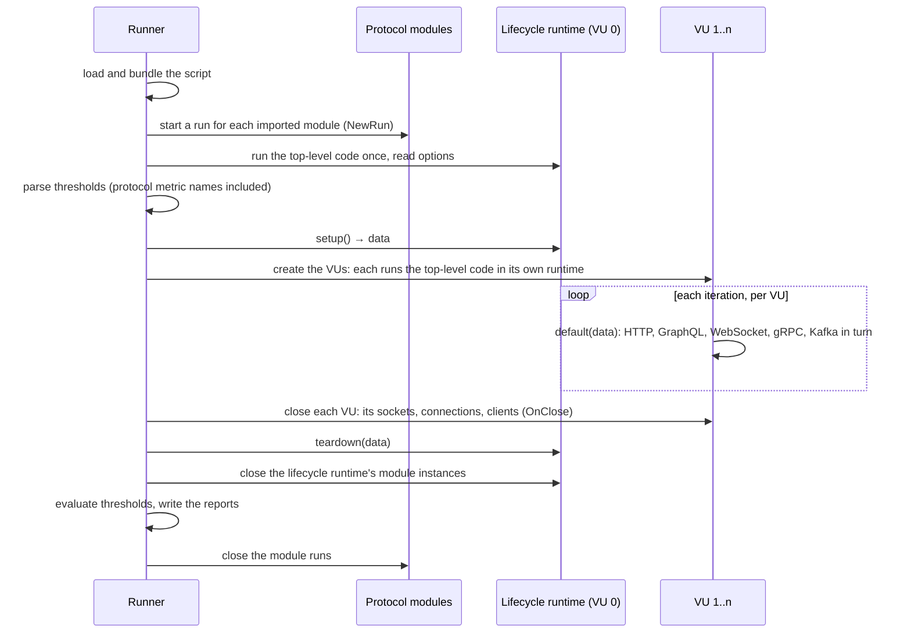

# Mixed-protocol tests

One LoadTool test can use several protocols in the same iteration.
[`examples/mixed-protocols.ts`](../examples/mixed-protocols.ts) uses five
of them in one user journey:

1. it logs in over HTTP;
2. it reads a product over GraphQL with the session's token;
3. it exchanges a message over WebSocket;
4. it calls a gRPC service;
5. it publishes an event to Kafka.

```bash
go run ./examples/server        # HTTP + WebSocket :8090, gRPC :8091, Kafka :9092
loadtool run examples/mixed-protocols.ts --vus 10 --duration 10s
```

This page describes how such a test runs. Each protocol's API is in the
[Script API](script-api.md).

## The execution flow



1. **Load.** The script is bundled with the modules it imports. Only
   imported protocol modules start, so a script without
   `loadtool/kafka` pays nothing for Kafka.
2. **Module runs start** before any script code, so top-level code may
   call them (`grpcClient.load(...)` parses `.proto` files there).
3. **Options and thresholds.** The top-level code runs once in the
   lifecycle runtime; options are read and thresholds parsed. A threshold
   on an unknown metric, such as a typo in `grpc_req_duraton`, fails here,
   before setup or any load.
4. **Setup** runs once. Its return value is every iteration's `data`.
   Its requests are not part of the load metrics.
5. **The VUs start.** Each VU is a goroutine with its own JavaScript
   runtime, and runs the top-level code again. In the example, that gives
   each VU its own gRPC client, GraphQL client and Kafka producer. None
   of them connects yet: network calls are not allowed in top-level code.
6. **Iterations.** Each runs the five steps in turn on the VU's
   goroutine. Every call blocks until it completes or times out, so the
   steps run in order, and the next one can use the previous one's
   result (the login's token).
7. **The VUs close** when the load phase ends. The runner closes every
   VU's module instances: open sockets, gRPC connections, Kafka clients
   (a consumer leaves its group).
8. **Teardown** runs once, even after an interruption, with setup's data.
9. **Thresholds are evaluated** and the summary and reports written.
   Last, the module runs close.

## Per-VU state

Each protocol keeps its state in the VU that made it, so no VU sees
another's:

| Protocol | State | Lifetime |
|---|---|---|
| HTTP | Cookie jar; connections from the shared pool (ADR-009) | The jar is reset each iteration (unless `noCookiesReset`); connections are reused |
| GraphQL | None of its own: it uses the VU's HTTP session (ADR-021) | As HTTP |
| WebSocket | The socket | Until `close()` (or, in the callback style, the end of `connect`); a socket left open is closed at the end of the iteration, with a warning |
| gRPC | The client's connection (one per VU) | From `connect` to the end of the test |
| Kafka | One franz-go client per `Producer`/`Consumer` (ADR-022) | From first use to the end of the test |
| Script variables | Top-level `let`/`const` | The VU's runtime, for the whole test |

The example's checks each compare with something only that VU sent: the
login's user, the echoed message, the gRPC greeting, and the Kafka key.
State that leaked between VUs would fail them.

## Shared metrics, checks, thresholds and reports

- **Metrics.** Each protocol records its own families: `http_*`,
  `graphql_*`, `ws_*`, `grpc_*` and `kafka_*` (ADR-015). GraphQL
  operations are not counted in `http_reqs` (scope decision 1).
- **Checks** from every protocol are counted together in `checks`.
- **Thresholds** may name any family, and mix them in one test.
- **Reports.** The console summary, the JSON summary and the HTML report
  include every family that recorded something.

## Cancellation

On Ctrl+C, or when `gracefulStop` runs out after the test's duration,
the VUs' context is cancelled:

- **Calls stop.** Every blocking call returns: HTTP and GraphQL requests,
  WebSocket reads, gRPC calls and streams, Kafka produces and consumes.
- **Calls cut short are not failures.** They are not recorded, so they
  neither fail thresholds nor count as errors.
- **Teardown still runs**, and then every VU's resources are closed.

## How it is tested

`TestMixedProtocolsEndToEnd` (`internal/runner/mixed_test.go`) runs the
example against in-process servers for all five protocols. It checks:

- every check passes in every iteration, and each protocol makes one call
  per iteration, counted in its own family;
- all nine thresholds pass;
- the JSON and HTML reports carry every protocol;
- setup's data reaches the iterations, and teardown runs;
- at the broker, every Kafka event was produced by the VU its key names;
- no goroutine is left after the run.

`TestMixedProtocolsCancellation` cancels the run while one VU waits for a
GraphQL response that never comes. It checks that the run returns
promptly as interrupted, with no failures recorded from cancelled calls,
that teardown runs, and that no goroutine is left.

CI's examples smoke test (`scripts/smoke-examples.sh`) also runs the
example against the demo API. These tests are the evidence for Phase 2
exit criterion 1.
