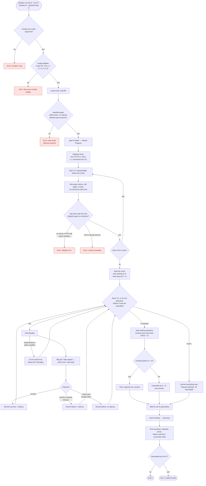
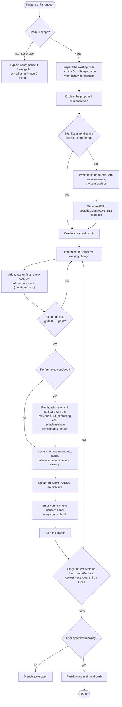

# Workflows

Three workflow diagrams:
1. [Test run](#1-test-run-workflow): what `loadtool run` does, from command
   to exit code.
2. [Development](#2-development-workflow): how changes are made to
   LoadTool.
3. [Benchmark](#3-benchmark-workflow): how the LoadTool, k6 and JMeter
   comparison is run.

For the components behind these steps, see [architecture.md](architecture.md).

---

## 1. Test run workflow

What happens for `loadtool run test.ts --vus N --duration D --graceful-stop G`.
- Red boxes end the run with **exit code 1 and no summary**: nothing was
  measured.
- Failed requests and script errors during the load phase are **counted,
  not fatal**: the run completes and exits 0.

A second Ctrl+C at any point terminates the process immediately: the
first one restores the default signal handling.

---

## 2. Development workflow

How a change goes from request to `main`, following `CLAUDE.md` and the
practice used in Phase 0.

The race detector runs in CI only: it needs cgo, and the Windows
development machine has no C compiler.

---

## 3. Benchmark workflow

How the comparison in `benchmarks/` is run with `measure.ps1`. See
[benchmarks/README.md](../benchmarks/README.md) for the methodology and
metric definitions.

```mermaid
flowchart TD
    prep(["Prepare"]) --> build["Build bin/loadtool.exe and bin/benchserver.exe"]
    build --> jmeter["Provide stock JMeter 5.6.3:<br/>no plugins in lib/ext, official properties"]
    jmeter --> run["./benchmarks/measure.ps1 -VUs 100,250,500,750,1000 ..."]
    run --> fresh{"OutDir already has runs.jsonl?"}
    fresh -->|yes| refuse["Stop: choose a new OutDir<br/>(sessions are never mixed)"]
    fresh -->|no| env["Record environment.json:<br/>CPU, RAM, OS, power, tool versions, commit"]
    env --> server["Start benchserver<br/>GET /api/test, fixed body, fixed delay"]
    server --> health{"GET /health OK?"}
    health -->|no| abort["Stop: server not healthy"]
    health -->|yes| level["Next VU level"]

    level --> warm["Warm-up: each tool once, 30 s<br/>(recorded as kind=warmup, excluded later)"]
    warm --> round["Measured round r of 3"]
    round --> tool["Next tool: LoadTool → k6 → JMeter"]
    tool --> launch["Launch the tool<br/>(JMeter: measure its java.exe child)"]
    launch --> sample["Sample the process every 250 ms:<br/>private bytes, working set"]
    sample --> exited["Process exits: read CPU time and wall time"]
    exited --> parse["Read the tool's own results:<br/>LoadTool summary · k6 JSON ·<br/>JMeter summary + JTL percentiles"]
    parse --> calc["Calculate CPU %, average memory,<br/>error rate, server CPU %"]
    calc --> append["Append one line to runs.jsonl;<br/>missing values stay empty"]
    append --> cool["Cool down 5 s"]
    cool --> moreTools{"More tools this round?"}
    moreTools -->|yes| tool
    moreTools -->|no| moreRounds{"More rounds?"}
    moreRounds -->|yes| round
    moreRounds -->|no| moreLevels{"More VU levels?"}
    moreLevels -->|yes| level
    moreLevels -->|no| stop["Stop the server"]

    stop --> summarize["./benchmarks/summarize.ps1:<br/>median (min–max) → summary.md / summary.csv"]
    summarize --> verify["Check the claims against raw data:<br/>error causes, overlap of ranges"]
    verify --> errs{"Target errors in the runs?"}
    errs -->|yes| caveat["Report throughput and latency as not<br/>comparable at those levels (environment-bound)"]
    errs -->|no| report
    caveat --> report["Write the report: environment, configuration,<br/>measured values · calculated values · observations"]
    report --> commitRes(["Commit the report and raw data<br/>(JMeter JTLs kept outside git, SHA-256 recorded)"])
```

